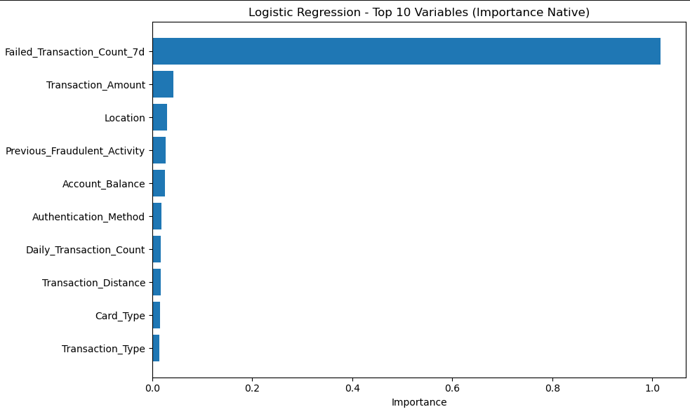
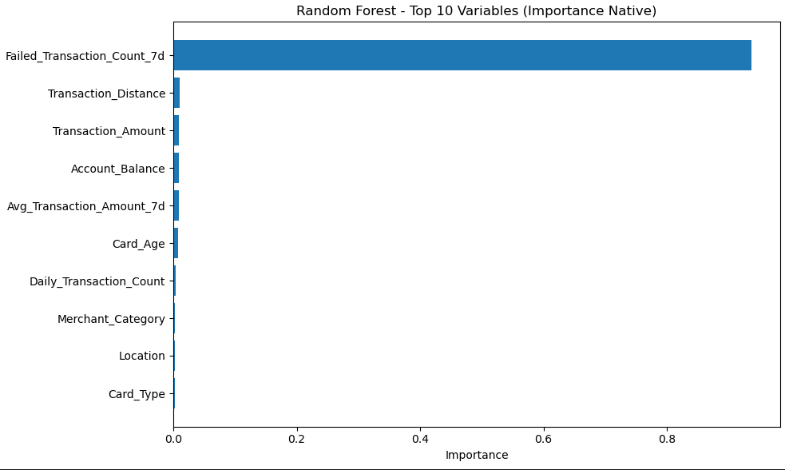
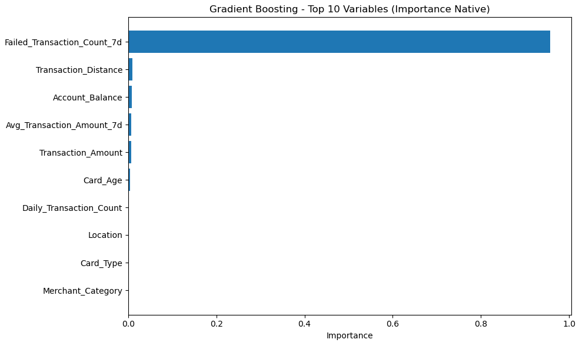
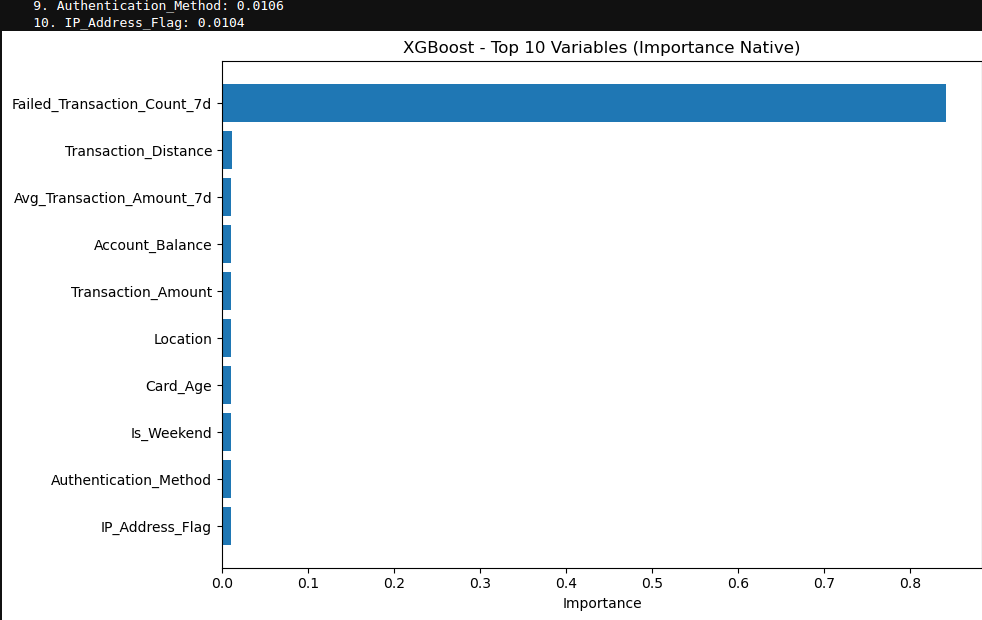
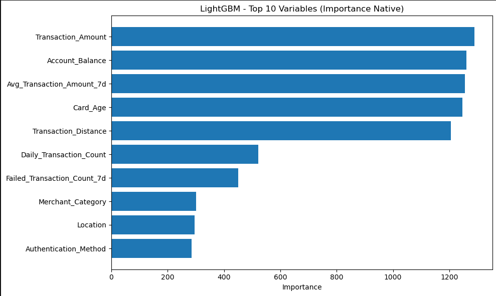

# 🛡️ Projet de Détection de Fraude Bancaire

##  Contexte et Enjeux
La fraude bancaire représente un défi majeur pour les institutions financières. Chaque année, des **milliards d’euros** sont perdus à travers différentes formes de fraude (usurpation d’identité, transactions non autorisées, falsification).

L’impact est double :
* **Financier** : pertes directes liées aux transactions.
* **Réputationnel** : perte de confiance des clients.

---

## 💰 Impact Économique
Chaque fraude non détectée entraîne un coût moyen de **3,10 €** de remboursement pour l’institution.

| Fraudes non détectées | Coût des remboursements |
| :--- | :--- |
| 1 000 | 3 100 € |
| 10 000 | 31 000 € |
| 100 000 | 310 000 € |

> ⚠️ *Ces chiffres n’incluent pas les coûts administratifs, d'enquête et les pertes de réputation.*

---

##  Pourquoi la Détection est Critique
1.  **Impact Financier Direct** : Remboursements et frais de contestation.
2.  **Volume Massif** : Le contrôle manuel est impossible sur des millions de transactions quotidiennes ; le **Machine Learning est indispensable**.
3.  **Réactivité** : Besoin de blocage **en temps réel**.
4.  **Équilibre Délicat** : Éviter d'être trop agressif (clients mécontents) ou trop conservateur (pertes financières).

---

## 🤖 Objectif du Projet
Développer un **système automatisé** capable de :
* Maximiser le **Rappel (Recall)** pour détecter un maximum de fraudes.
* Maintenir une **Précision** élevée pour limiter les fausses alertes.
* Optimiser le **coût-bénéfice global** du système.

---

## 🛠️ Approche Méthodologique
1.  **Exploration (EDA)** : Identification des patterns de fraude.
2.  **Feature Engineering** : Création de variables sur les comportements récents, la localisation et les anomalies.
3.  **Modélisation** : Comparaison de 5 algorithmes (Logistic Regression, Random Forest, GBDT, XGBoost, LightGBM).
4.  **Validation** : Cross-validation **5-fold** et métriques adaptées aux données déséquilibrées.

---

##  Résultats : Évaluation des Modèles

L'analyse repose sur le compromis Rappel/Précision :

* **Régression Logistique** : Présente le Rappel le plus élevé (**0.916**), mais sa faible précision (**0.349**) bloquerait trop de clients légitimes.
* **Modèles d'Ensemble (RF, GB, XGB, GBM)** : Offrent une **Précision exceptionnelle (proche de 1.000)**, garantissant la fiabilité des alertes.
* **Choix Final** : **LightGBM** est retenu car il offre le meilleur équilibre avec un Rappel de **0.620** (le plus élevé des modèles robustes) et une Précision de **0.997**.

---

## 🧠 Analyse de l'Interprétabilité : Pourquoi le Modèle Prédit la Fraude ?

### 1. Régression Logistique (Baseline)

* **Signal Maître** : `Failed_Transaction_Count_7d` est le prédicteur n°1 (Score 1.0).
* **Analyse** : Le modèle est très sensible aux échecs de paiement récents mais génère trop de faux positifs.

### 2. Random Forest

* **Précision de 100%** : Idéal pour un blocage automatique sans risque pour les clients légitimes.
* **Variables clés** : Introduit la notion de distance (`Transaction_Distance`) et d'ancienneté (`Card_Age`).

### 3. Gradient Boosting (GBM)

* **Variables Clés** : Comme les autres modèles d'ensemble, il s'appuie massivement sur l'historique d'échecs, mais affine sa précision (0.997) via la correction séquentielle des erreurs.
* **Synthèse** : Offre une performance robuste avec un AUC de **0.810**, égalant les meilleurs modèles d'ensemble.

### 4. Gradient Boosting & XGBoost

* **Rigueur** : XGBoost atteint **99.9% de précision**.
* **Focus** : Focalisation extrême sur les signaux techniques (IP, Authentification).

### 5. LightGBM (Modèle Final)

* **Vision Multidimensionnelle** : Contrairement aux autres, il équilibre l'importance entre le montant, le solde et l'historique. 
* **Bénéfice** : Cette nuance lui permet de capturer plus de fraudes (**Recall 62%**) tout en restant ultra-fiable.

---

## 🔁 Reproductibilité & Bonnes Pratiques
* **Seeds fixées** pour des résultats constants.
* **Séparation stricte** des jeux de données (Train/Val/Test).
* **Pipelines clairs** pour le prétraitement et la modélisation.

---

## 📈 Impact Attendu (Exemple pour 10 000 transactions)
| Approche | Fraudes manquées | Coût des pertes | Économie réalisée |
| :--- | :---: | :---: | :---: |
| Sans système | 100 | 310 € | - |
| **Avec IA (LightGBM)** | 38 | 117.80 € | **+ 192.20 €** |

---
##  Conclusion : La supériorité de LightGBM face aux "Fraudes Silencieuses"

L'enjeu majeur de ce projet était de dépasser la détection "évidente" pour capturer des schémas de fraude sophistiqués que les modèles standards peinent à identifier.

###  L'avantage comparatif de LightGBM

Alors que des modèles comme la **Régression Logistique** ou **XGBoost** se focalisent massivement sur la variable `Failed_Transaction_Count_7d`, ils deviennent vulnérables face aux fraudeurs expérimentés qui réussissent leurs transactions du premier coup.

* **La limite des modèles classiques** : Si une transaction ne présente pas d'échecs préalables, ces modèles ont tendance à la classer comme légitime, laissant passer des fraudes "propres" mais coûteuses.
* **La force de LightGBM** : Grâce à une distribution d'importance beaucoup plus équilibrée, LightGBM analyse des signaux plus subtils. Même en l'absence d'échecs de paiement, il identifie une anomalie en croisant des variables de contexte :
    * Le ratio **Montant / Solde du compte** (`Transaction_Amount` vs `Account_Balance`).
    * La déviation par rapport à la **moyenne hebdomadaire** (`Avg_Transaction_Amount_7d`).
    * L'incohérence de la **distance géographique** (`Transaction_Distance`).

### 📈 Pourquoi 62.0% est une victoire métier

Cette vision multidimensionnelle permet à **LightGBM** d'atteindre un Rappel de **0.620**, là où les autres modèles à haute précision plafonnent à **0.618**. 

Ces **0.2% de différence** ne sont pas une simple variation statistique : ils représentent la capture des fraudes les plus complexes, celles qui contournent les barrières de sécurité classiques basées sur la "force brute" (tentatives répétées).

### Bilan Final

Le déploiement de **LightGBM** garantit non seulement une **Précision de 99.7%** (quasiment aucune fausse alerte pour les clients), mais assure surtout une couverture contre les stratégies de fraude émergentes. **C'est le modèle qui offre la sécurité la plus résiliente et la plus intelligente pour l'institution financière.**

---

## 👤 Auteur
**Kossi Noumagno** *Data Analyst / Passionné par le Machine Learning & l`IA*
